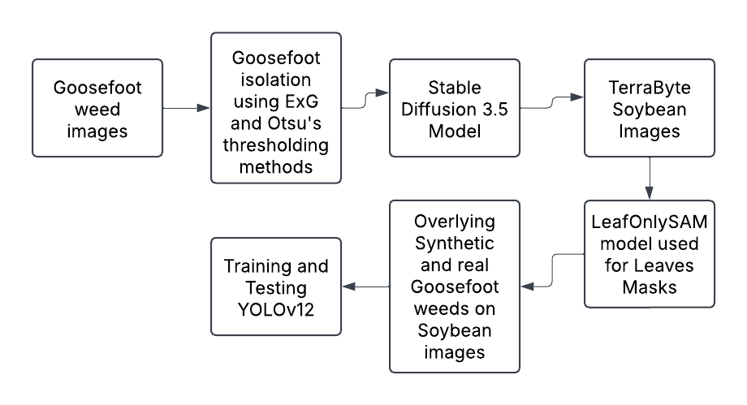
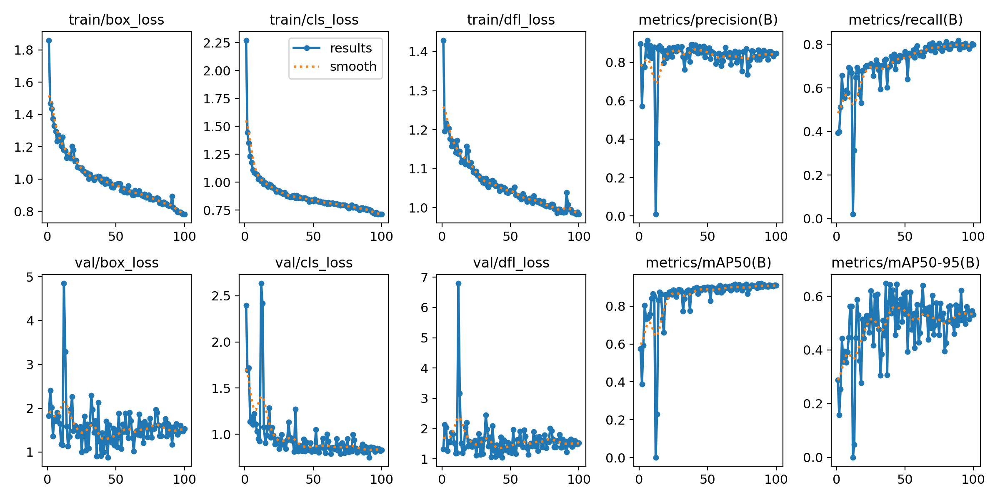
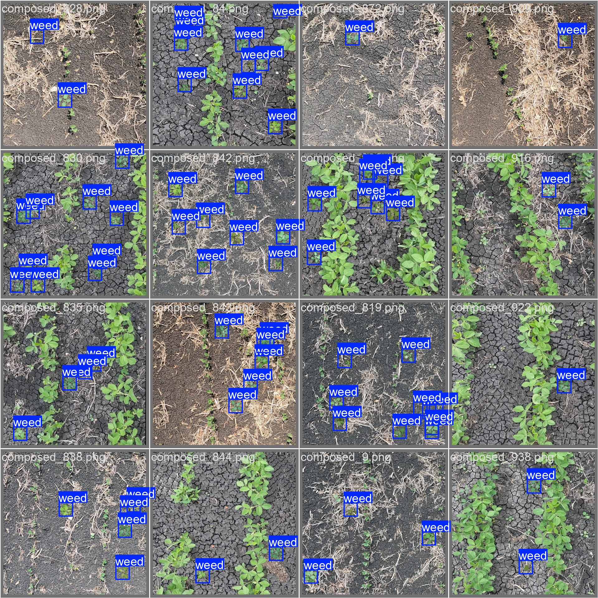
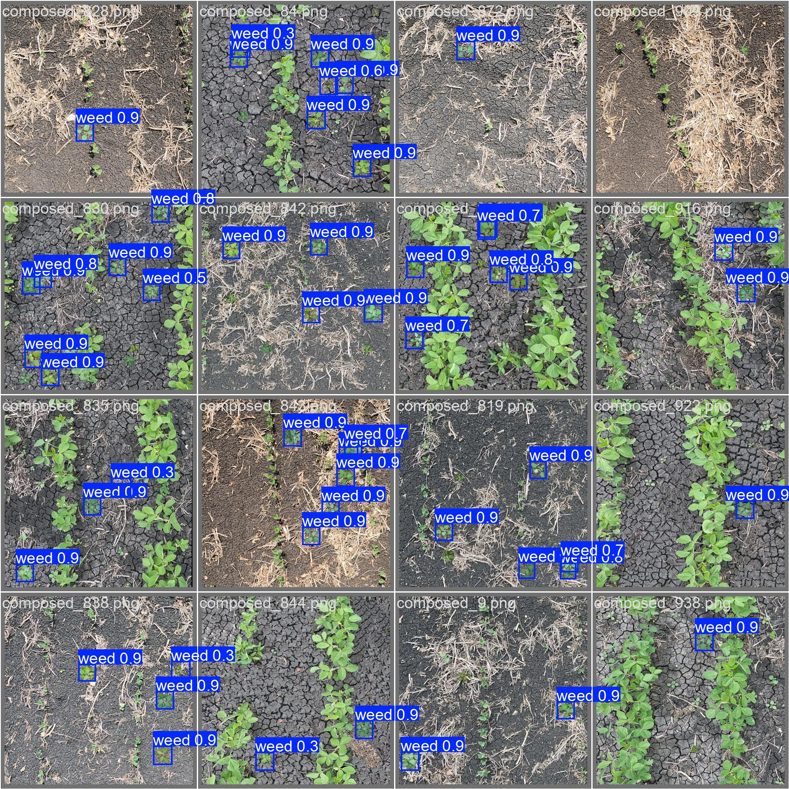
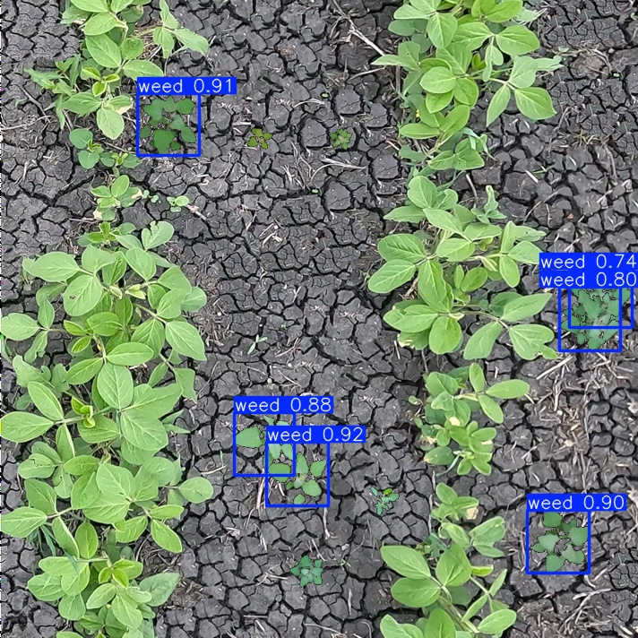
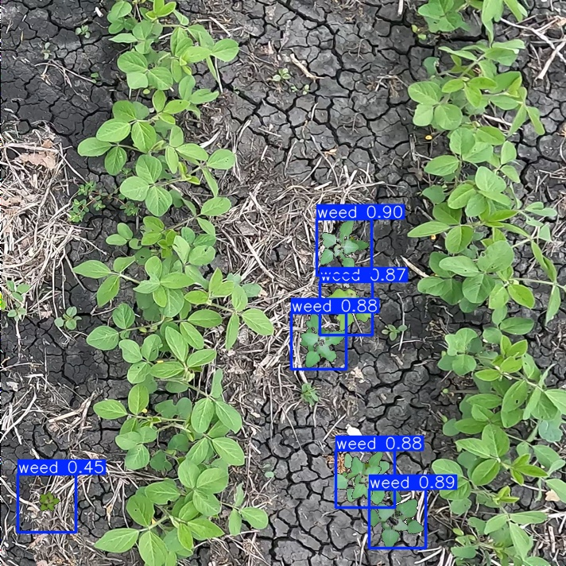

# DIP-Project-Codes
This repository contains the complete implementation of our Digital Image Processing course project, which focuses on constructing a Goosefoot weed https://foragingguru.com/goosefoot-plant/ detection dataset using advanced image processing techniques and synthetic data generation. It includes Jupyter notebooks, datasets, and output results. The project uses ExG and Otsu methods for weed isolation, trains a stable diffusion 3.5 model (https://github.com/Stability-AI/sd3.5) for generating synthetic weeds, segments soybean crops using the LeafOnlySAM model (https://github.com/Dom3442/leafonlysam), and overlays weed images onto realistic crop backgrounds to create agricultural scenes. The final dataset is used to train a YOLOv12 model (Nano Version) (https://github.com/sunsmarterjie/yolov12) for Goosefoot detection.
# Workflow of the Project



 
# Initial Dataset
For this project 332 images of Goosefoot (chenopodium Album) weed were used from the GitHub repository: [zhangchuanyin/weed-datasets](https://github.com/zhangchuanyin/weed-datasets) as the primary source.
# Sample Weed Image


# Digital Image Processing Techniques
The provided Python script performs weed isolation using a combination of image processing techniques. It processes a batch of Goosefoot weed images and removes background noise to create clean, black-background images suitable for dataset construction. The main steps include:

Excess Green (ExG) Calculation to highlight vegetation.

Binary Thresholding to separate plant from background.

Small Object Removal to clean noise.

Green Segmentation in HSV Space to preserve true plant areas.

Output Generation of isolated weed images with visualization.
📥 [Download image techniques.ipynb](https://github.com/Tareq-Ahmad/DIP-Project-Codes/blob/main/image%20techniques.ipynb?raw=true)
Note: To run the above code you need Python, OpenCv, Numpy and Matplotlib librarries installed. 
# Preprocessing Techinques on the Isolated weeds
Once the weeds are isolated using ExG and Otsu's thresholding methods, you can centralize the weeds on images using the following code.  
# Stable Diffusion 3.5 Model
For this project, I used Stable Diffusion 3.5 (medium) and traine it on the isolated Gooosefoot images. The model should be clonned to a docker container using the official github repo (https://github.com/Stability-AI/sd3.5?tab=readme-ov-file). 
# LeafOnlySAM model
This model was employed on soybean plants for generating segmentation masks for the soybean leaves. To be able to use LeafOnlySAM model you have first install SAM model (https://github.com/facebookresearch/segment-anything). Below is the code for LeafOnlySAM:
📥 [Click here to download the notebook](https://github.com/Tareq-Ahmad/DIP-Project-Codes-1/releases/download/v1.0/Code.for.Using.LeafOnlySAM.ipynb)

# Training Scenes

Below is a simple Python script for compositing weed images onto soybean background images.

📥 [Download training_scenes.py](https://github.com/Tareq-Ahmad/DIP-Project-Codes-1/releases/download/v2.0/training_scenes.py)

# Training YOLOv12

For this project, we trained the state-of-the-art [YOLOv12](https://github.com/Tareq-Ahmad/DIP-Project-Codes/releases/download/v1.2/yolov12n.pt) model (Nano version) on the constructed dataset. The complete code from dataset split to training, testing, and model evaluation is documented in the [YOLO12_training.py](https://github.com/Tareq-Ahmad/DIP-Project-Codes/releases/download/v1.2/YOLO12_training.py) file available in the release section.


### Installation

```bash
wget https://github.com/Dao-AILab/flash-attention/releases/download/v2.7.3/flash_attn-2.7.3+cu11torch2.2cxx11abiFALSE-cp311-cp311-linux_x86_64.whl
conda create -n yolov12 python=3.11
conda activate yolov12
pip install -r requirements.txt
pip install -e .
```

### Training Configuration

| **Hyperparameters**     | **Values**                                      |
|-------------------------|--------------------------------------------------|
| Epochs                  | 100                                              |
| Optimizer               | Adam                                             |
| Learning Rate           | 0.002                                            |
| Momentum                | 0.9                                              |
| Weight Decay            | 0.0005                                           |
| Batch Size              | 16                                               |
| Image Size              | 640 × 640                                        |
| Annotation Format       | YOLO format                                      |
| Dataset Split           | 70% training, 15% validation, 15% testing        |
| Training Time           | Approx. 52 minutes                               |

### Prediction

```python
from ultralytics import YOLO

model = YOLO('yolov12{n}.pt')
model.predict()
```
# Results

Below is the model's performance after it was trained on the training images and validated on the validation images:
# Model's Perfromance

 

# Validation





# Model's Performance on Test Images




