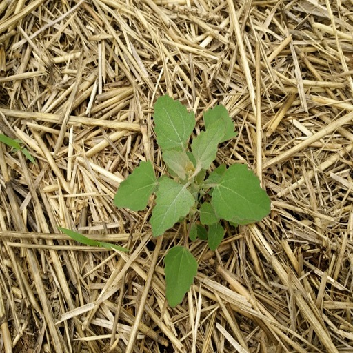
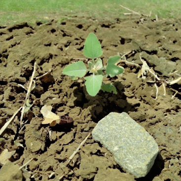

# DIP-Project-Codes
This repository contains the complete implementation of our Digital Image Processing course project, which focuses on constructing a Goosefoot weed https://foragingguru.com/goosefoot-plant/ detection dataset using advanced image processing techniques and synthetic data generation. It includes Jupyter notebooks, datasets, and output results. The project uses ExG and Otsu methods for weed isolation, trains a stable diffusion 3.5 model (https://github.com/Stability-AI/sd3.5) for generating synthetic weeds, segments soybean crops using the LeafOnlySAM model (https://github.com/Dom3442/leafonlysam), and overlays weed images onto realistic crop backgrounds to create agricultural scenes. The final dataset is used to train a YOLOv12 model (Nano Version) (https://github.com/sunsmarterjie/yolov12) for Goosefoot detection.
# Workflow of the Project


 
# Initial Dataset
For this project 332 images of Goosefoot (chenopodium Album) weed were used from the GitHub repository: [zhangchuanyin/weed-datasets](https://github.com/zhangchuanyin/weed-datasets) as the primary source.
# Sample Weed Image


# Digital Image Processing Techniques

The provided Python notebook performs weed isolation using a series of image processing techniques. It processes a batch of Goosefoot weed images and removes background noise to generate clean, black-background images suitable for dataset construction.

The main steps include:

- **Excess Green (ExG) Calculation** to highlight vegetation.
- **Binary Thresholding** to separate plant from background.
- **Small Object Removal** to eliminate noise.
- **Green Segmentation in HSV Color Space** to preserve true plant areas.
- **Output Generation** with visualizations of the isolated weed images.

 [Download `image techniques.ipynb`](https://github.com/Tareq-Ahmad/DIP-Project-Codes/blob/main/image%20techniques.ipynb?raw=true)

**Note:** The above code can't be displayed on our GitHub Repository since it's a very large file. Also, to run the code, you need Python installed with the following libraries: `OpenCV`, `NumPy`, and `Matplotlib`.
 
## Stable Diffusion 3.5 Medium – Model Access

The **Stable Diffusion 3.5 Medium** model (`sd3.5_medium.safetensors`) is too large to host directly on GitHub. You can download it from the official Hugging Face repository:

 [Download sd3.5_medium.safetensors from Hugging Face](https://huggingface.co/stabilityai/stable-diffusion-3.5-medium/blob/main/sd3.5_medium.safetensors)

> **Note:** You must have a Hugging Face account and be signed in to access and download the file.

After downloading, place the file in your working directory and use it with the `diffusers` library or your own custom pipeline for inference and fine-tuning.

---

## Installation

To install the required dependencies for Stable Diffusion 3.5 Medium, use the following command:

```bash
pip install -r requirements_SD3.5.txt


```

## Train (DreamBooth Fine-Tuning)

The model was fine-tuned using DreamBooth on **Stable Diffusion 3.5 Medium** with 332 isolated weed images. The training was done on one NVIDIA RTX A6000 GPU (49 GB) for approximately 6.5 hours using the following command:

```bash
accelerate launch train_dreambooth_lora.py \
  --pretrained_model_name_or_path="path/to/sd3.5_medium.safetensors" \
  --instance_data_dir="path/to/isolated_images" \
  --output_dir="path/to/output" \
  --instance_prompt="a photo of isolated goosefoot image" \
  --resolution=768 \
  --train_batch_size=1 \
  --gradient_accumulation_steps=4 \
  --learning_rate=5e-6 \
  --lr_scheduler="constant" \
  --lr_warmup_steps=0 \
  --max_train_steps=10000 \
  --mixed_precision="bf16" \
  --checkpointing_steps=500 \
  --validation_prompt="a photo of sks weed in the field" \
  --validation_epochs=200 \
  --seed=42 \
  --report_to="tensorboard"
```
### Stable Diffusion Results After Training
When the model is trained, we can give the model some text prompt to generate synthetic images. Below is one sample text prompt along with the generated image. 

Text Promt "A tiny Goosefoot weed with four fresh green leaves sprouting from slightly uneven, moist soil, positioned a few inches away from a smooth, weathered stone. The plant’s leaves have delicate, slightly serrated edges and catch the morning light, creating a soft glow on their surfaces. The nearby stone is rough and speckled with earthy tones, partially buried in the soil, and casting a subtle shadow. The surrounding soil is textured with small clumps of earth, a few scattered dry leaves, and tiny roots breaking through the surface"




### Training Scenes

Below is a simple Python script for compositing weed images onto soybean background images.

 [Download training_scenes.py](https://github.com/Tareq-Ahmad/DIP-Project-Codes-1/releases/download/v2.0/training_scenes.py)

### Training YOLOv12

For this project, we trained the state-of-the-art [YOLOv12](https://github.com/Tareq-Ahmad/DIP-Project-Codes/releases/download/v1.2/yolov12n.pt) model (Nano version) on the constructed dataset. The complete code from dataset split to training, testing, and model evaluation is documented in the [YOLO12_training.py](https://github.com/Tareq-Ahmad/DIP-Project-Codes/releases/download/v1.2/YOLO12_training.py) file available in the release section.


### Installation

```bash
wget https://github.com/Dao-AILab/flash-attention/releases/download/v2.7.3/flash_attn-2.7.3+cu11torch2.2cxx11abiFALSE-cp311-cp311-linux_x86_64.whl
conda create -n yolov12 python=3.11
conda activate yolov12
pip install -r requirements.txt
pip install -e .
```

### Training Configuration

| **Hyperparameters**     | **Values**                                      |
|-------------------------|--------------------------------------------------|
| Epochs                  | 100                                              |
| Optimizer               | Adam                                             |
| Learning Rate           | 0.002                                            |
| Momentum                | 0.9                                              |
| Weight Decay            | 0.0005                                           |
| Batch Size              | 16                                               |
| Image Size              | 640 × 640                                        |
| Annotation Format       | YOLO format                                      |
| Dataset Split           | 70% training, 15% validation, 15% testing        |
| Training Time           | Approx. 52 minutes                               |

### Prediction

```python
from ultralytics import YOLO

model = YOLO('yolov12{n}.pt')
model.predict()
```
# Results

Below is the model's performance after it was trained on the training images and validated on the validation images:
# Model's Perfromance

 

# Validation


# Model's Performance on Test Images


